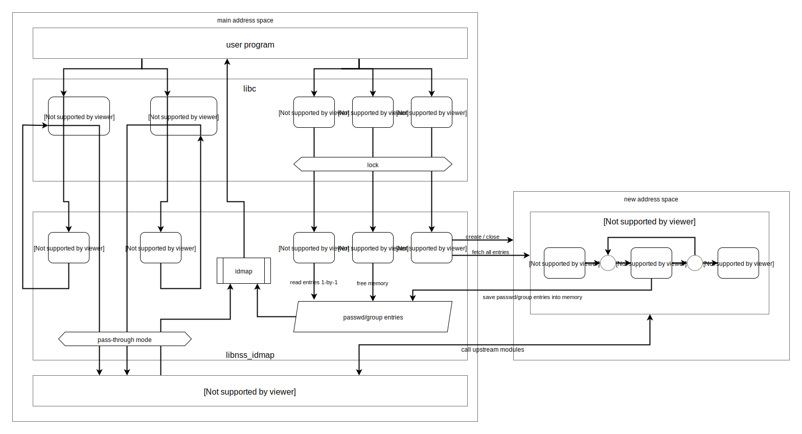

# Synopsis
Linux Name Service Switch module to transparently substitute UIDs and GIDs in existing passwd and group databases

# How does it work

It's an nsswitch modules like `files`, `compat`, `nis`, or `sssd`. It calls other modules configured on the system, but replaces IDs (according to configuration) before returns the answer.

# Examples

see config [examples](src/idmap.examples)

# issues
Please submit issues via PR to some file `issue/TITLE.txt`.
